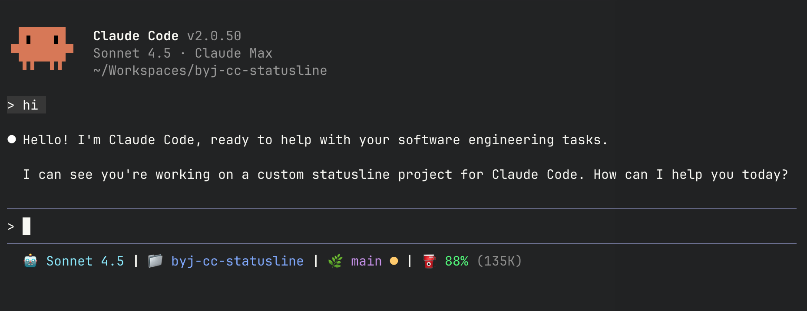

# byj-cc-statusline

> **byj** = **B**it**Y**oung**J**ae

[](https://opensource.org/licenses/MIT) 

## 📊 Overview

A curated statusline for Claude Code (CC) - showing only the essentials. Displays context usage like a car's fuel gauge and API utilization at a glance.

**Lightweight:** Single bash script, no external dependencies except `jq` and `curl`.



## 📖 What Each Part Shows

### 🤖 Model Name

Shows the current Claude model you're using.

```
🤖 Sonnet 4.5
```

### 📁 Directory

Current working directory name (not full path, just the folder name).

```
📁 my-project
```

### 🌿 Git Status

Git branch name with colored status indicators:

| Symbol | Meaning                 | Example          |
| ------ | ----------------------- | ---------------- |
| 🔴     | Modified files (unstaged)| `🌿 main 🔴`    |
| 🟢     | Staged files            | `🌿 main 🟢`    |
| 🟡     | Untracked files         | `🌿 main 🟡`    |
| ✅     | Clean - no changes      | `🌿 main ✅`    |

Symbols can combine: `🌿 main 🔴🟢` = modified + staged files

> **Note:** In the actual terminal, these are displayed as ANSI-colored dots (`●`) and checkmark (`✓`).

### ⛽ Fuel Gauge

Shows remaining safe context before autocompact triggers.

**Format:** `⛽ XX% (XXK)` where:

- **XX%** = Percentage of safe space remaining
- **(XXK)** = Actual token count remaining

**Color coding:**

- 🟢 Green (≥70%): Safe - plenty of space
- 🟡 Yellow (30-70%): Caution - moderate usage
- 🔴 Red (<30%): Warning - autocompact imminent (icon changes to ⚠️)

**Example:** `⛽ 36% (57K)` means:

- 36% of safe space left
- 57,000 tokens remaining before autocompact

### 📊 API Usage Gauge

Shows Anthropic API utilization from the Usage API.

**Format:** `📊 5h XX% · 7d XX%` where:

- **5h XX%** = 5-hour session utilization
- **7d XX%** = 7-day weekly utilization

**Color coding:**

- 🟢 Green (<50%): Low usage
- 🟡 Yellow (50-80%): Moderate usage
- 🔴 Red (≥80%): High usage

**Caching:** API responses are cached for 180 seconds with rate-limit backoff support.

## 🚀 Installation

### Recommended: Clone and install

```bash
git clone https://github.com/BitYoungjae/byj-cc-statusline.git
cd byj-cc-statusline
bash install-statusline.sh
```

The installer will:

- ✅ Check dependencies (jq)
- ✅ Backup existing configuration to `~/.local/share/byj-cc-statusline/backups/`
- ✅ Copy `bin/statusline.sh` to `~/.claude/`
- ✅ Update `~/.claude/settings.json`

### Alternative: Remote install (no clone required)

```bash
curl -fsSL https://raw.githubusercontent.com/bityoungjae/byj-cc-statusline/main/install-statusline.sh -o /tmp/install.sh && \
curl -fsSL https://raw.githubusercontent.com/bityoungjae/byj-cc-statusline/main/bin/statusline.sh -o /tmp/statusline.sh && \
STATUSLINE_SOURCE=/tmp/statusline.sh bash /tmp/install.sh
```

### Manual install

```bash
# 1. Copy statusline script
cp bin/statusline.sh ~/.claude/
chmod +x ~/.claude/statusline.sh

# 2. Update settings.json
# Add to ~/.claude/settings.json:
{
  "statusLine": {
    "type": "command",
    "command": "~/.claude/statusline.sh",
    "padding": 0
  }
}

# 3. Restart Claude Code
```

## 📋 Requirements

- **Claude Code** v2.0+
- **jq** - JSON parser
- **curl** - For API usage fetching

Install dependencies:

```bash
# macOS
brew install jq

# Linux
sudo apt install jq  # Ubuntu/Debian
sudo yum install jq  # CentOS/RHEL
```

## ⚙️ How the Fuel Gauge Works

The fuel gauge reads `context_window` data provided by Claude Code via stdin, including `context_window_size` and current token usage.

Claude Code reserves buffer space for context management:

| Auto-compact Setting | Buffer Size | Safe Limit (200K example) |
|---------------------|-------------|---------------------------|
| **ON** (default)    | 22.5%       | 155K                      |
| **OFF**             | 1.5%        | 197K                      |

Autocompact setting is read from `~/.claude.json`.

**Calculation example (auto-compact ON, 200K context):**

```
Total context:     200,000 tokens
Autocompact buffer: 45,000 tokens (22.5%)
─────────────────────────────────────────
Safe limit:        155,000 tokens

Current usage:      97,830 tokens
Remaining fuel:     57,170 tokens → ⛽ 36%
```

The percentage shows how much safe space you have left before hitting the buffer threshold.

## ⚙️ How the API Usage Gauge Works

The API usage gauge fetches utilization data from the Anthropic Usage API:

- **Endpoint:** `GET https://api.anthropic.com/api/oauth/usage`
- **Auth:** OAuth token from macOS Keychain (`Claude Code-credentials`) or `~/.claude/.credentials.json`
- **Cache:** `~/.cache/byj-cc-statusline/usage.json` (180 second TTL)
- **Rate limiting:** Respects `Retry-After` headers with 300 second default backoff
- **Fallback:** Serves stale cache when API is unavailable or rate-limited

## 📁 Project Structure

```
byj-cc-statusline/
├── README.md                  # This file
├── LICENSE                    # MIT License
├── CLAUDE.md                  # Claude Code instructions
├── .gitignore                 # Git ignore rules
├── install-statusline.sh      # Automated installer
└── bin/
    └── statusline.sh          # Core statusline script
```

## 🛠️ Troubleshooting

**Statusline not working?**

- Ensure jq is installed: `which jq`
- Restart Claude Code

**Fuel gauge shows nothing?**

- Start a conversation first (requires usage data)

**API usage not showing?**

- Ensure you're logged in to Claude Code with OAuth
- Check if `curl` is available: `which curl`
- Cache is at `~/.cache/byj-cc-statusline/usage.json`

## 🔄 Updates

```bash
cd byj-cc-statusline
git pull
bash install-statusline.sh
```

Your existing settings will be automatically backed up to:
`~/.local/share/byj-cc-statusline/backups/`

## 📝 License

MIT License - see [LICENSE](LICENSE) file for details.

## 🔗 Links

- Repository: [https://github.com/BitYoungjae/byj-cc-statusline](https://github.com/BitYoungjae/byj-cc-statusline)
- Issues: [https://github.com/BitYoungjae/byj-cc-statusline/issues](https://github.com/BitYoungjae/byj-cc-statusline/issues)
